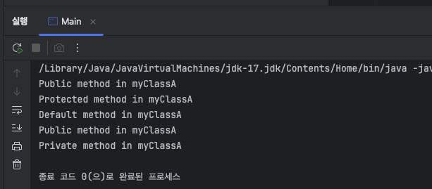
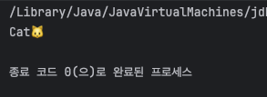
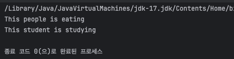

# Chapter1. 추가 미션

## 자바 접근제어자

자바의 접근제어자는 아래와 같이 4가지가 존재한다. 

- `public`: 모든 클래스에서 접근이 가능
- `protected` : **같은 패키지나 상속받은 클래스**에서 접근 가능
- `default`: **같은 패키지**에서만 접근 가능하며 명시적으로 `default` 키워드는 X
- `private`: **같은 클래스** 내에서만 접근 가능

### 접근제어자 예제 코드

packageA/MyClassA:

```java
package packageA;

public class MyClassA {
    public void publicMethod() {
        System.out.println("Public method in myClassA");
    }
    protected void protectedMethod() {
        System.out.println("Protected method in myClassA");
    }

    void defaultMethod(){
        System.out.println("Default method in myClassA");
    }

    private void privateMethod(){
        System.out.println("Private method in myClassA");
    }

    public void callPrivateMethod() {
        privateMethod(); // 같은 클래스에서 private 메서드 호출 가능
    }
}
```

packageA에서 하나의 클래스를 만들고 그 안에 4가지 접근 제어자가 적용된 메서드를 정의

packageA/ChildClassA:

```java
package packageA;

public class ChildClassA extends MyClassA {
    public void testMethods() {
        publicMethod(); // 접근 가능 (상속받은 클래스, public)
        protectedMethod(); // 접근 가능 (상속받은 클래스, protected)
        defaultMethod(); // 접근 가능 (같은 패키지, default)
        //privateMethod(); // 접근 불가 (private)
    }
}
```

MyClassA로부터 상속 받아온, 동일 패키지의 클래스 ChildCalssA에서 `public`, `protected`, `default`만 접근 가능

packageB/OtherClassB:

```java
package packageB;

import packageA.MyClassA;

public class OtherClassB {
    public void testMethods() {
        MyClassA obj = new MyClassA();
        obj.publicMethod();    // 접근 가능 (public)
        // obj.protectedMethod(); // 접근 불가 (다른 패키지에서 protected)
        // obj.defaultMethod();   // 접근 불가 (다른 패키지에서 default)
        // obj.privateMethod();   // 접근 불가 (private)
    }
}
```

다른 패키지인 packageB에 만들어진 OtherClassB는 public에만 접근 가능

Main.java:

```java
import packageA.MyClassA;
import packageA.ChildClassA;
import packageB.OtherClassB;

public class Main {
    public static void main(String[] args) {
        // 1. 같은 패키지의 클래스에서 호출하는 경우
        ChildClassA child = new ChildClassA();
        child.testMethods();  // public, protected, default 접근 가능

        // 2. 다른 패키지의 클래스에서 호출하는 경우
        OtherClassB other = new OtherClassB();
        other.testMethods();  // public '만' 접근 가능

        // 3. 같은 클래스 내에서 private 메서드를 호출하는 경우
        MyClassA obj = new MyClassA();
        obj.callPrivateMethod();  // 같은 클래스 내에서는 private 도 호출 가능!
    }
}
```

상속받은 ChildClass가 아닌 MyClassA에서는 private접근 가능

위 예제코드 출력: 



## 클래스와 인터페이스

- 클래스 : 클래스는 객체를 생성할 수 있는 틀의 역할이며, 멤버 변수(필드)와 메서드로 구성된다.
- 인터페이스 : 자바에서 클래스를 통한 다중 상속은 지원되지 않는다. 그러나 다중상속의 이점을 버릴 수는 없기에 인터페이스를 통해 다중 상속을 지원한다. **인터페이스란 다른 클래스를 작성할 때 기본이 되는 틀을 제공하면서, 다른 클래스 사이의 중간 매개 역할까지 담당하는 일종의 추상 클래스**
- 차이점: 클래스는 객체를 생성할 수 있고 상태(필드)를 가질 수 있지만, 인터페이스는 오로지 메서드의 선언만 포함

### 클래스/인터페이스 예제코드

```java
interface Animal {
    void sound(); // 추상 메서드
}

class Cat implements Animal {
    public void sound() {
			System.out.println("Cat🐱");
    }
}
// Main.java
class Main {
    public static void main(String[] args) {
        Animal animal = new Cat();
        animal.sound(); 
    }
}
```

### 클래스/인터페이스 실행 결과:



## 상속

OOP에서는 부모(상위) 클래스와 자식(하위) 클래스가 있으며, 자식 클래스는 부모 클래스를 선택해서 그 부모의 멤버를 상속받아 그대로 쓸 수 있게 된다.

이런 상속을 통해 이미 마련되어 있던 클래스를 재사용해서 만들 수 있기에 효율적으로 개발이 가능, 하지만 상속을 하더라도 자식 클래스가 부모의 모든 것을 물려받는것은 아니다.

- 앞서 접근제어자에서 다룬 대로, 부모 클래스의 `private` 접근 제한을 갖는 필드 및 메소드는 자식이 물려받을 수 없다.
- 부모와 자식클래스가 서로 다른 패키지에 있을 경우, 부모의 `default` 접근 제한을 갖는 필드 및 메소드도 자식이 물려받을 수 없다.

자바에서는 `extends` 키워드를 사용하여 상속을 구현

### 상속 예제 코드:

```java
class People {
    void eat() {
        System.out.println("This people is eating");
    }
}

class Student extends People {
    void studying() {
        System.out.println("This student is studying");
    }
}
// Main.java
class Main {
    public static void main(String[] args) {
        Student student = new Student();
        student.eat();  // 부모 클래스의 메서드
        student.studying(); // 자식 클래스의 메서드
    }
}
```

### 상속 실행결과:



### 면접 질문

- 자바에서 `protected`와 `default` 접근 제어자의 차이
- 인터페이스와 추상 클래스의 차이
- 상속과 인터페이스 구현의 차이점은 무엇