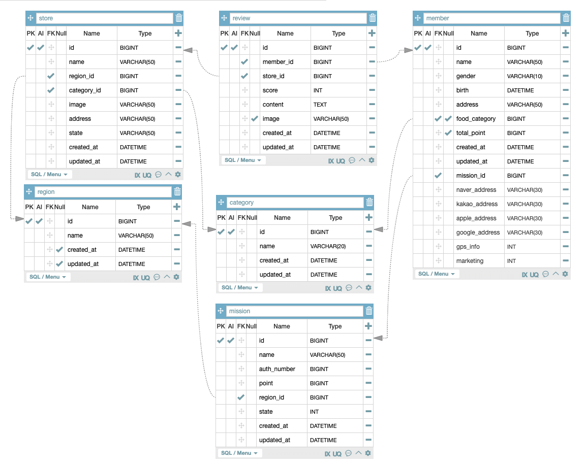

# Chpater1. 미션

- **member (회원)**
    - `member` 테이블은 서비스 사용자에 대한 정보를 저장
    - 사용자 이름, 성별, 생년월일, 주소 등의 정보를 포함하며, 사용자의 소셜 로그인 정보 (네이버, 카카오, 애플 등)도 관리합니다.
    - 사용자는 선호하는 음식 카테고리와 총 포인트, 그리고 참여한 미션에 대한 정보를 가짐
    - 사용자는 미션에 참여할 수 있으며, 미션 수행을 통해 포인트를 적립 가능
- **store (상점)**
    - `store` 테이블은 서비스에서 리뷰를 남길 수 있는 상점들에 대한 정보를 저장
    - 상점의 이름, 지역, 카테고리, 이미지, 주소 등의 정보가 포함
    - 각 상점은 특정 지역(`region`)과 카테고리(`category`)에 속함
    - 상점 정보는 사용자가 리뷰를 남길 수 있음
- **review (리뷰)**
    - `review` 테이블은 각 사용자가 상점에 남긴 리뷰를 저장합니다. 리뷰에는 사용자의 점수, 내용, 이미지 등이 포함되며, 리뷰를 남긴 사용자(`member_id`)와 상점(`store_id`)의 관계를 나타냄
    - 이를 통해 사용자는 상점에 대한 리뷰를 작성하고, 다른 사용자는 해당 상점에 대한 평점과 리뷰를 확인 가능
- **region (지역)**
    - `region` 테이블은 상점이 위치한 지역 정보를 저장
    - 지역의 이름과 생성일, 수정일 등의 정보가 기록
    - 이를 통해 사용자는 특정 지역에 있는 상점만을 탐색
- **category (카테고리)**
    - `category` 테이블은 상점의 카테고리 정보를 저장합니다.
    - 각 상점은 특정 카테고리에 속하며, 사용자는 카테고리별로 상점을 탐색
- **mission (미션)**
    - `mission` 테이블은 서비스 내에서 사용자가 수행할 수 있는 미션 정보를 담고 있음.
    - 각 미션에는 미션 이름, 인증 번호(`auth_number`), 미션을 수행하면 얻을 수 있는 포인트(`point`), 그리고 해당 미션이 활성화된 상태(`state`) 등의 정보가 기록
    - 미션은 특정 지역(`region_id`)과 연결되어 있어, 사용자는 미션을 수행하여 포인트를 적립할 수 있음