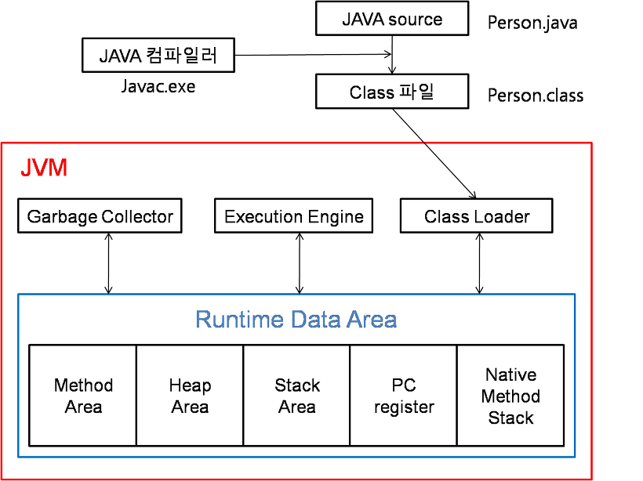

# Chapter2. 추가 미션_static, JVM, class loader, collection interface

## Static 과 JVM 메모리 관계

만들어진 클래스를 사용하려면, 기본적으로 객체를 생성하는 과정을 거쳐야한다. 그러나 main 클래스는 객체를 생성하는 과정이 없어도 실행이 된다. → static 키워드

- JVM 메모리 구조
    
    
    
    아래와 같이 나눌 수 있다.
    
    - Method Area
    - Heap
    - Stack
    - PC Register
    - Native Method Stack
    
    여기서 `static`으로 선언된 필드, 메서드는 **Method Area**에 저장된다. 
    
    > Method Area: 클래스 수준의 메타데이터를 저장하는 공간, JVM이 클래스 로딩 시 여기에 클래스 관련 정보와 함께 static필드와 메서드를 로드함
    > 
    
    `static` 변수는 애플리케이션 라이프사이클동안 유지되고 클래스 처음 로딩때 할당되며 JVM이 종료될 때까지 메모리에 유지된다.
    

## Static 과 JVM ClassLoader 관계

> ClassLoader: 컴파일 된 자바의 클래스 파일(*.class)을 동적으로 로드하고, JVM의 메모리 영역인 Runtime Data Areas에 배치하는 작업을 수행
> 
- 클래스가 처음 호출될 때 ClassLoader는 클래스를 메모리에 로드하고, 이 과정에서 클래스의 static 필드들이 초기화
- ClassLoader는 계층적으로 동작한다.
- 각 클래스는 처음 로딩때 필요한 모든 **static 멤버**를 **MethodArea**에 올린다.

- 클래스 로더가 클래스 파일을 로딩하는 순서
    1. Loading(로드): 클래스 파일을 가져와 JVM의 **메모리에 로드**
    2. Linking(링크): 클래스 파일을 사용하기 위해 **검증**하는 과정
    3. Initialization(초기화): 클래스 변수들을 **적절한 값으로 초기화**

⚠️ 유의 : 메모리에 올리는 Loading 기능은 한번에 메모리에 올리지 않고, 어플리케이션에서 **필요한 경우 동적으로 메모리에 적재**

엄연히 로드와 초기화는 다른 과정이며, JVM은 **실행될 때 모든 클래스를 메모리에 올려놓지 않고, 그때 마다 필요한 클래스를 메모리에 올려 효율적으로 관리**한다.

### Static 예제 코드 및 실행 결과

StaticExample.java : 

```java
public class StaticExample {
    // static 필드 : 메모리의 Method Area에 저장
    static int staticVariable = 10;

    static void staticMethod() {
        System.out.println("스태틱 메서드 호출");
    }
}
```

Main.java:

```java
public class Main {
    public static void main(String[] args) {
        System.out.println("스태틱 변수: " + StaticExample.staticVariable);
        StaticExample.staticMethod();
    }
}
```


## Collection Interface 동작 방식


- List, Queue, Set에 상속을 하는 **실질적 최상위 컬렉션**
- 업캐스팅으로 다양한 종류의 컬렉션 자료형을 받아 자료 삽입, 삭제, 탐색 기능을 할 수 있음(다형성)

### 컬렉션 인터페이스 예제 코드 및 실행결과

CollectionExample.java :

```java
import java.util.ArrayList;
import java.util.Collection;
import java.util.HashSet;
import java.util.LinkedList;

public class CollectionExample {

    // 필드 선언 및 초기화
    Collection<Number> col1 = new ArrayList<>();
    Collection<Number> col2 = new HashSet<>();
    Collection<Number> col3 = new LinkedList<>();

    // 생성자
    public CollectionExample() {
        // 요소 추가 작업은 생성자 내부에서 수행
        col1.add(1);
        col2.add(1);
        col3.add(1);
    }

    // 컬렉션 데이터를 출력하는 메서드
    public void printCollections() {
        System.out.println("ArrayList: " + col1);
        System.out.println("HashSet: " + col2);
        System.out.println("LinkedList: " + col3);
    }
}
```

Main.java :

```java
public class Main {
    public static void main(String[] args) {
        // CollectionExample 객체 생성
        CollectionExample example = new CollectionExample();

        // CollectionExample의 메서드를 이용해 컬렉션 출력
        example.printCollections();
    }
}

```


### 면접질문
1. JVM 메모리 구조에서 static 변수는 어느 영역에 저장되나요?
2. static 키워드의 역할과 그 특징은 무엇인가요?
3. Collection 인터페이스는 어떤 방식으로 동작하나요?