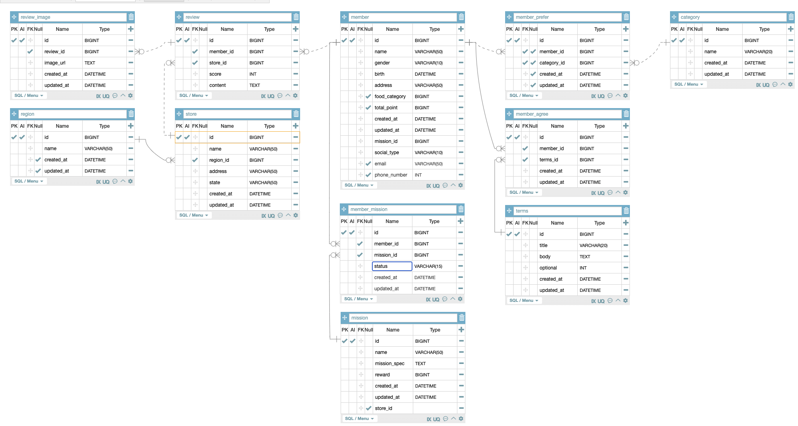

# Chpater3. 미션



참고용 ERD설계

### 홈화면 API

<aside>
🔑 GET /home

</aside>

홈화면의 경우 그냥 루트(/)로 설정할 수 있으나 명시적으로 홈화면임을 나타내기 위해 위와 같이 설계하였다.

### 마이페이지

<aside>
🔑 GET /member/my-page/{user-id}

</aside>

마이페이지의 경우 어떤 유저의 마이페이지인지 서버에 요청할 필요가 있기 때문에 Path Variable을 사용해준다.

또한 마이페이지의 경우 사용자의 로그인 정보가 필요하기 때문에 **Request Header**에 로그인 상태를 전달하는 토큰을 담아서 전달한다.

```jsx
Authorization : accessToken (String)
```

### 리뷰작성

사용자가 리뷰를 작성하는 방법에는 미션페이지에서의 리뷰작성, 가게의 리뷰 탭에서 리뷰작성 2가지 방법이 존재한다. 그러나 두가지 모두 리뷰를 작성하는 페이지로 넘어가는 것이 관건이고 이때 필요한 정보는 ‘어떤 가게에 대한 리뷰인가’ 정도로 보이므로 어느 곳에서 리뷰 남기기를 누르던 `new-review` 로 GET 요청을 하도록 설계하였다. 이 때 어떤 가게에 대한 리뷰인지는 Path Variable 로 넘겨준다.


미션 페이지에서 리뷰 작성으로 접근


가게 리뷰 리스트 페이지에서 리뷰 작성으로 접근

<aside>
🔑 GET /new-review/{store-id}

</aside>

리뷰 작성 페이지에서 리뷰를 작성하는 POST요청을 보내는 API 설계

<aside>
🔑 POST /review/{store-id}

</aside>

Request Body

```json
{
	"user_id": "작성하는 유저의 id"
	"store_id": "리뷰가 달릴 가게",
	"score": "리뷰 별점",
	"content": "리뷰내용 작성",
	"image_url": "이미지 경로", // image 테이블 따로 생성
}
```

### 미션 목록 조회(진행중, 진행 완료)

진행중인 미션과 성공한 미션을 불러오는 API endpoint 설계

<aside>
🔑 GET /member/mission**?state=proceeding&success**

</aside>

N:M관계에 있으므로 비즈니스 로직을 고려하여야 하는데 이때, 화면에서 보여지는 것은 모든 사람에게 동일하게 보이는 미션이 아니라 ‘특정 회원이 조회하는 자신의 미션’ 이라는 것에 초점을 맞춰야 한다고 생각하여 `/member/mission` 으로 작성 해준다.


진행중인 미션과 완료한 미션을 동시에 보는게 아니라 따로 조회하는 경우

<aside>
🔑 GET /member/mission**?state=proceeding**

</aside>

(진행중)

<aside>
🔑 GET /member/mission**?state=success**

</aside>

(진행완료)

모든 미션 접근은 ‘로그인한 멤버의 미션’을 기준으로 하므로 , 접근 권한을 확인하고 해당 멤버임을 확인하여야 한다. 따라서 Request Header에 토큰을 전달할 필요가 있다.

**Request Header**

```sql
Authorization : accessToken (String)
```

### 미션 성공 누르기

미션의 상태를 성공으로 바꾸는 요청이기 때문에 `PATCH`

<aside>
🔑 PATCH /member/mission/{mission-id}

</aside>

**Request Body**

```json
{
  "state":"success"
}
```

### 회원가입 하기

회원가입 페이지로 넘어가는 GET요청

<aside>
🔑 GET /member/sign-up

</aside>

회원가입 페이지에서 서버로 보내는 POST 요청

<aside>
🔑 POST /member/sign-up

</aside>

**Request Body**

```json
{
  	"name":"유저 이름",
  	"gender":"성별",
  	"birth":"0000-00-00",
  	"address":"주소"
}
```