ApiResponse - 통일된 API 응답을 위한
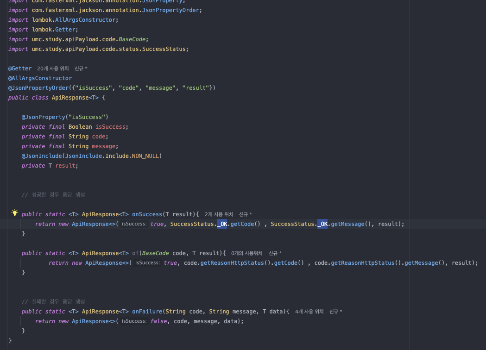

에러 형식 DTO
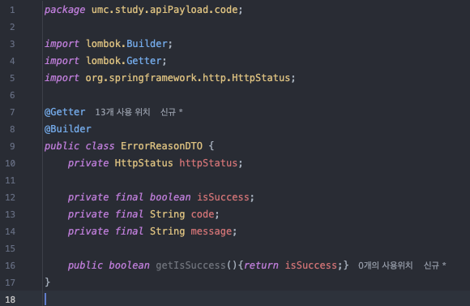
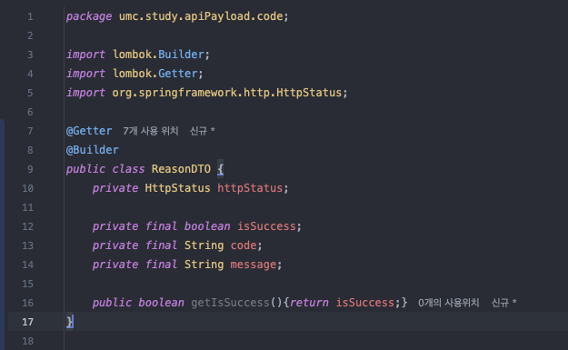
에러 상태 enum
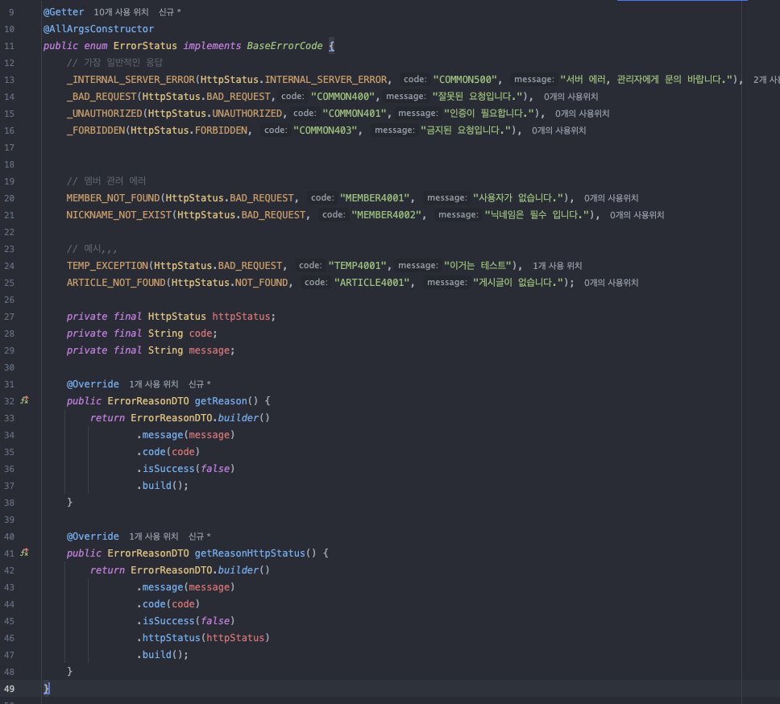
성공 상태 enum
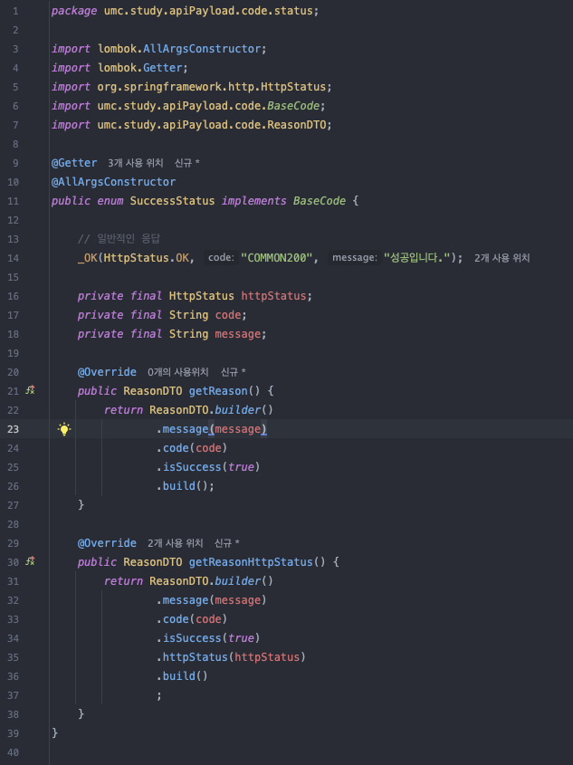
서비스
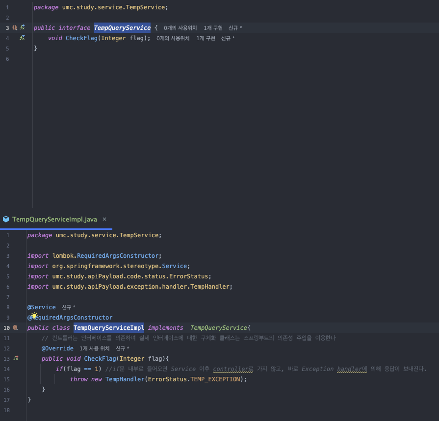
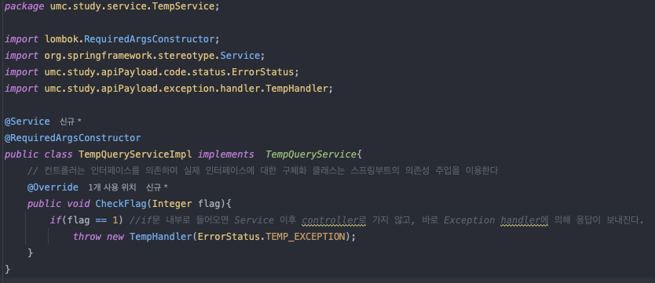
컨트롤러
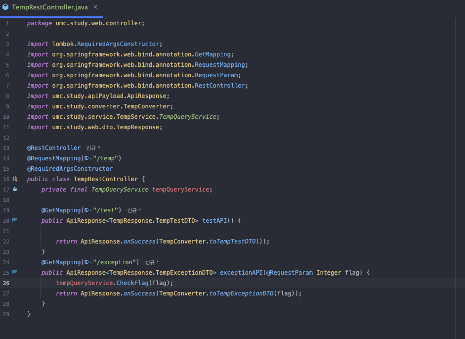
컨버터
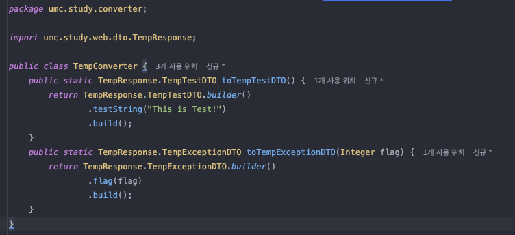
응답 DTO
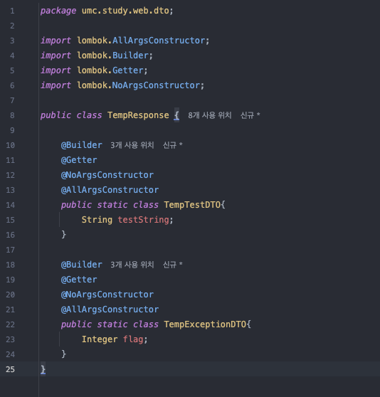
핸들러
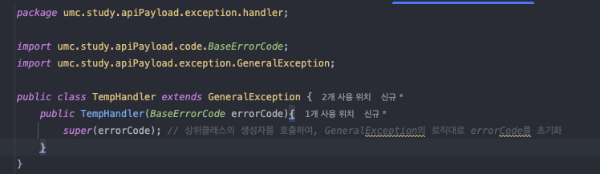
ExceptionAdvice - `@RestControllerAdvice`를 예외처리에 적용
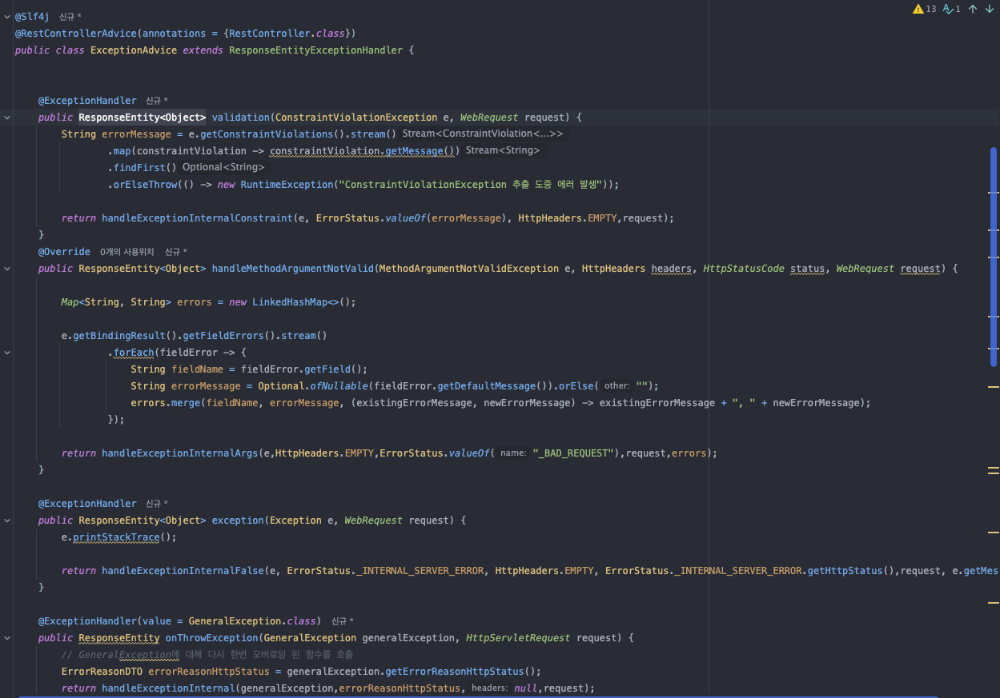

`/temp/test` 경로 실행 결과:
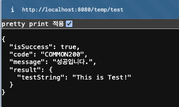

`/temp/exception?flag` 실행결과:
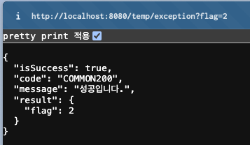